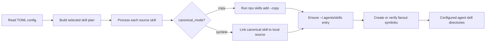
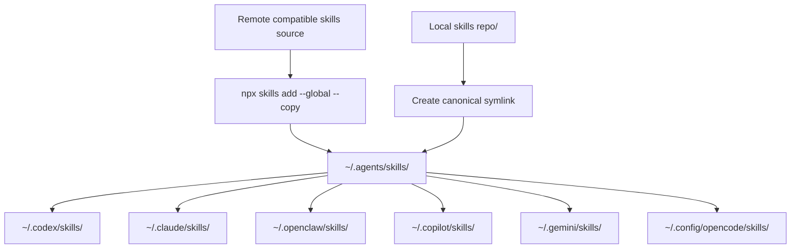

# Skills Installer

Wrapper around `npx --yes skills@latest` for repeatable external skill installs.

## Table of Contents

- [Purpose](#purpose)
- [Requirements](#requirements)
- [Install](#install)
- [Make Targets](#make-targets)
- [Configuration](#configuration)
- [Canonical Modes](#canonical-modes)
- [Install Workflow](#install-workflow)
- [Usage](#usage)
- [Link Topology](#link-topology)
- [Validation](#validation)

## Purpose

`install_external_agent_skills.sh` installs or links skills from configured
compatible repositories into `~/.agents/skills`, then fans them out to
agent-specific skill directories as symlinks.

The script keeps `npx skills@latest` as the installer source of truth while
making your local multi-agent wiring repeatable.

## Requirements

Runtime requirements:

- `python3`
- Node.js/npm with `npx`
- `git` when using path/category filters against remote Git sources

Validation requirements:

- `shellcheck`
- `markdownlint`

Python uses `tomllib` or `tomli` when available. The script also includes a
minimal parser for the TOML shape used by this project config.

## Install

```sh
make install
```

This installs:

```text
~/.local/bin/install_external_agent_skills.sh
~/.config/skills-installer/external-skills.conf
```

The config file is copied only when it does not already exist.

## Make Targets

`make` and `make help` print available targets without changing files.

```sh
make
make help
```

## Configuration

Edit:

```text
~/.config/skills-installer/external-skills.conf
```

The file is TOML. This is a minimal example:

```toml
canonical_dir = "~/.agents/skills"
installer_agent = "codex"
canonical_mode = "copy"
default_agents = ["codex", "claude-code", "openclaw"]
full_depth = true

[agent_targets]
codex = "~/.codex/skills"
claude-code = "~/.claude/skills"
openclaw = "~/.openclaw/skills"

[[sources]]
name = "marcomc-skills"
source = "marcomc/skills"
canonical_mode = "copy"
include = ["*"]
exclude = ["personal", "in-progress", "deprecated"]
exclude_paths = ["personal", "in-progress", "deprecated"]
full_depth = true

[[sources]]
name = "local-marcomc-skills-dev"
source = "/path/to/local/skills"
canonical_mode = "symlink"
include = ["*"]
exclude_paths = ["personal", "in-progress", "deprecated"]
agents = ["codex", "claude-code", "openclaw"]
full_depth = true
```

`source` accepts the same source formats supported by `skills add`, including
GitHub shorthand such as `marcomc/skills`, full Git URLs, and local directories.

`include`, `exclude`, and `exclude_paths` support exact names and shell-style
globs. When the source can be inspected as a local or cloneable Git repository,
path segments such as `personal`, `in-progress`, and `deprecated` can also be
used as category filters.

## Canonical Modes

Each source can choose how entries under `~/.agents/skills` are managed:

| Mode | Behavior | Use For |
| --- | --- | --- |
| `copy` | Runs `npx --yes skills@latest add ... --global --copy`. | Remote/public repos and stable third-party skills. |
| `symlink` | Creates `~/.agents/skills/<skill>` as a symlink to a local source skill dir. | Local development checkouts you edit directly. |

`symlink` requires `source` to be a local directory, or a separate local
`link_source` value:

```toml
[[sources]]
name = "marcomc-skills-local-link"
source = "marcomc/skills"
link_source = "/path/to/local/skills"
canonical_mode = "symlink"
include = ["*"]
```

In symlink mode, `link_source` is also the default discovery source, so local
development checkouts can be installed without a network lookup. Override this
with `discovery_source` only when the discovery tree intentionally differs from
the local link tree.

## Install Workflow

This diagram shows the runtime path from the TOML config to canonical skill
entries and agent fanout links.



## Usage

Preview the resolved plan:

```sh
install_external_agent_skills.sh --list-plan
```

Run without changing files:

```sh
install_external_agent_skills.sh --dry-run
```

Install or link canonical skills and repair fanout symlinks:

```sh
install_external_agent_skills.sh
```

Replace existing non-symlink agent skill directories with backups before
linking:

```sh
install_external_agent_skills.sh --force-links
```

Use an alternate config:

```sh
install_external_agent_skills.sh --config ./external-skills.conf
```

Script options:

| Option | Effect |
| --- | --- |
| `-c, --config FILE` | Use an alternate TOML config file. |
| `--dry-run` | Print planned commands and link changes without mutating files. |
| `--force-links` | Move existing conflicting targets to `*.backup.TIMESTAMP` before linking. |
| `--list-plan` | Print the resolved source, skill, mode, and target plan. |
| `--no-install` | Skip canonical install/linking and only repair agent fanout links. |
| `--no-link` | Install or link canonical skills but skip agent fanout links. |
| `-h, --help` | Show command help. |

## Link Topology

This diagram shows the shared canonical layer used by both copy and symlink
sources before agent-specific links are created.



The second symlink intentionally points to the `~/.agents/skills` symlink, not
directly to the original repository path.

Existing non-symlink targets are left untouched unless `--force-links` is used.

## Validation

```sh
make validate
```

Validation runs `shellcheck --enable=all` and `markdownlint`.
It also runs the local smoke test for symlink-mode planning and fanout.
