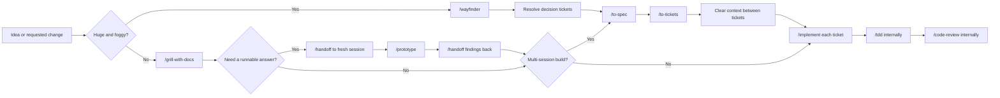
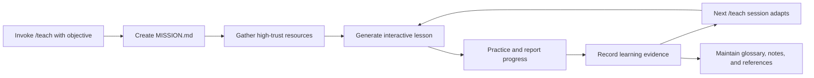

# Matt Pocock Skills Installation and Workflow Reference

## Purpose

Use this guide to:

- install or update the promoted skills from `mattpocock/skills` through this
  repository's multi-agent installer;
- select the right Matt Pocock workflow for a task;
- understand how the skills compose without treating every skill as mandatory;
- account for differences between the July 2026 videos and the current upstream
  repository.

The workflow analysis is based on every Matt Pocock YouTube release from 6 June
through 21 July 2026 and was cross-checked against the official skills
repository at commit `ed37663`.

YouTube transcripts were auto-generated and can contain recognition errors.
Where a transcript conflicts with the newer repository, this guide treats the
current upstream skill as the operational contract.

## Install or Update Through Skills Installer

### Configure the source

First install this repository's wrapper:

```sh
make install
```

Add the following source to
`~/.config/skills-installer/external-skills.conf`:

```toml
[[sources]]
name = "matt-pocock-skills"
source = "mattpocock/skills"
canonical_mode = "copy"
include = ["*"]
exclude = ["personal", "in-progress", "deprecated"]
exclude_paths = ["personal", "in-progress", "deprecated"]
agents = [
  "codex",
  "claude-code",
  "openclaw",
]
full_depth = true
```

Adjust `agents` to match the `[agent_targets]` entries configured on the
machine. The exclusions keep experimental, personal, and deprecated upstream
skills out of the promoted install.

### Preview and install

Always inspect the resolved selection before updating:

```sh
install_external_agent_skills.sh --list-plan
install_external_agent_skills.sh --dry-run
install_external_agent_skills.sh
```

The normal run:

1. invokes the latest `skills` installer package;
2. resolves the unpinned `mattpocock/skills` repository at its current default
   branch;
3. stages each selected skill in an isolated temporary home;
4. atomically replaces its canonical copy under `~/.agents/skills`;
5. creates or verifies the configured agent fanout symlinks.

Therefore, rerunning the wrapper downloads the currently available upstream
version of each selected Matt Pocock skill. It does not pin a release tag or
commit. Review `--list-plan` and `--dry-run` first because upstream skills can
be added, renamed, promoted, or removed.

This diagram shows the update path for Matt Pocock's skills.

```mermaid
flowchart LR
  accTitle: Matt Pocock skills update through skills-installer
  accDescr: Shows plan and dry-run checks followed by staging, canonical replacement, and agent fanout.
  config["Configure mattpocock/skills"] --> plan["Review --list-plan"]
  plan --> dryRun["Review --dry-run"]
  dryRun --> install["Run installer"]
  install --> upstream["Fetch current upstream skills"]
  upstream --> filter["Apply include and exclude filters"]
  filter --> stage["Stage copies in temporary HOME"]
  stage --> canonical["Replace ~/.agents/skills copies"]
  canonical --> fanout["Verify agent fanout links"]
```



After the first installation in a project, invoke
`/setup-matt-pocock-skills`. It configures the issue tracker, triage vocabulary,
and documentation layout assumed by the other engineering skills.

## Videos Reviewed

| Date | Video | Focus |
| --- | --- | --- |
| 16 July 2026 | [Complete AI Coding workflow][workflow-video] | Installation, setup, and the current end-to-end workflow |
| 8 July 2026 | [Skills v1.1][v11-video] | Wayfinder, research, implement, to-spec, and to-tickets |
| 8 June 2026 | [Learn anything with `/teach`][teach-video] | Stateful learning and codebase onboarding |

These were the only channel releases inside the 45-day review window, and all
three discussed the skills repository.

## Recommended Engineering Workflow

The default route begins with `/grill-with-docs`. `/wayfinder` is a heavier
on-ramp for an effort whose decision space cannot fit in one session.



Keep `/grill-with-docs`, `/to-spec`, and `/to-tickets` in one context while it
remains inside the model's effective context or "smart zone". Start each
implementation ticket in a fresh context.

### Sequence by objective

| Objective | Recommended sequence |
| --- | --- |
| Small, well-scoped feature | `/grill-with-docs` → optional prototype detour → `/implement` |
| Feature requiring several sessions | `/grill-with-docs` → optional prototype detour → `/to-spec` → `/to-tickets` → fresh `/implement` per ticket |
| Huge, foggy greenfield project or feature | `/wayfinder` → resolve decision tickets → `/to-spec` → `/to-tickets` → fresh `/implement` per ticket |
| UI or behavioural uncertainty | `/handoff` → `/prototype` → `/handoff` findings into the normal flow |
| External facts needed first | background `/research` → cited repository note → `/grill-with-docs` → normal flow |
| Incoming raw bugs or feature requests | `/triage` → `/implement`; do not triage `/to-tickets` output |
| Hard, intermittent, or unclear bug | `/diagnosing-bugs`; implement after obtaining a tight failing feedback loop |
| Architecture upkeep | `/improve-codebase-architecture` → select an opportunity → `/grill-with-docs` → normal flow |
| Concrete behaviour that is already understood | `/tdd` directly |
| Review an existing branch or pull request | `/code-review` directly |
| No codebase or non-code plan | `/grill-me` |
| Multi-session learning or codebase onboarding | `/teach` repeatedly in a dedicated stateful workspace |

## Wayfinder Decision Rule

The [v1.1 video introduces Wayfinder][v11-wayfinder] enthusiastically and says
it is particularly useful for front-end work because visual and behavioural
questions often need prototypes. The later end-to-end video and current router
narrow that guidance:

- Use `/wayfinder` when the effort is both large and foggy enough that its
  decision space cannot fit in one session.
- Use `/grill-with-docs` for a well-scoped feature, including ordinary
  front-end work.
- Use `/prototype` whenever a UI or behaviour must be experienced rather than
  settled in conversation.
- Wayfinder produces decisions, not production code. Its normal exit is
  `/to-spec`, not `/implement`.

## Skills Introduced or Reframed

| Skill | Status in this period | Purpose |
| --- | --- | --- |
| `/teach` | Newly promoted | Stateful teaching over multiple sessions; records the mission, resources, lessons, progress, glossary, and reference material |
| `/ask-matt` | New router | Chooses the appropriate skill or flow for the user's situation |
| `/implement` | New orchestrator in v1.1 | Implements a spec or ticket, drives TDD at agreed seams, validates, and finishes with code review |
| `/research` | New in v1.1 | Runs primary-source research in a background agent and saves a cited Markdown note |
| `/wayfinder` | New and promoted in v1.1 | Maps a huge foggy effort into decision tickets until the route can be specified |
| `/to-spec` | Rename and broader replacement for `/to-prd` | Synthesizes the settled conversation into a durable specification without restarting the interview |
| `/to-tickets` | Replacement for `/to-issues` and the short-lived planning split | Converts a specification into tracer-bullet tickets with explicit blocking edges |
| `/code-review` | Renamed and promoted from `/review` | Reviews a fixed diff on two independent axes: repository standards and specification compliance |

The videos also describe important changes to existing skills:

- `/grill-with-docs` asks one question at a time, distinguishes discoverable
  facts from decisions only the human can make, and requires confirmation before
  implementation.
- `/tdd` owns red-green slices. Refactoring moves to `/code-review` instead of
  being forced into every red-green cycle.
- `/prototype` is integrated as a planning detour and a Wayfinder ticket type;
  it was not itself introduced during this period.

## Stateful `/teach` Workflow

`/teach` is a standalone learning loop, not part of the software delivery
pipeline.



Use it in an empty or dedicated learning directory. For codebase onboarding,
the target repository becomes the subject matter and lessons should connect new
concepts to the learner's existing technical knowledge.

## Operational Caveats

### Upstream `/implement` commits automatically

The upstream `/implement` skill explicitly instructs the agent to commit the
completed work. If commits require separate user authorization, edit the copied
skill after installation or maintain an approved local variant without that
instruction.

Because the wrapper replaces canonical copies on update, record local
customizations separately and reconcile them after upstream updates. Do not
assume edits inside a copied canonical skill will survive the next install.

### Current upstream documentation drift

At the inspected upstream commit, `/ask-matt` is the strongest source for
sequencing, but some wording is inconsistent:

- `/ask-matt` says there are two on-ramps but lists three: triage,
  diagnosing bugs, and Wayfinder.
- The README describes TDD as red-green-refactor, while the current TDD skill
  assigns refactoring to code review.
- The README calls Wayfinder units "investigation tickets", while the skill
  calls them "decision tickets".
- `/ask-matt` says prototype code is deleted, while the current prototype skill
  preserves it on a throwaway branch as primary-source evidence.

Pinning `source` to a Git URL with an explicit revision is not currently a
documented wrapper workflow. If exact reproducibility is required, use a local
checkout at the desired revision with `canonical_mode = "symlink"`, or extend
the installer with a deliberately tested pinning mechanism.

## Primary Sources

- [Matt Pocock skills repository][skills-repository]
- [Current `/ask-matt` workflow router][ask-matt]
- [Current `/wayfinder` contract][wayfinder]
- [Current `/teach` contract][teach-skill]
- [Skills v1.1 release][v11-release]
- [16 July workflow video][workflow-video]
- [8 July v1.1 video][v11-video]
- [8 June teach video][teach-video]

[ask-matt]: https://github.com/mattpocock/skills/blob/ed37663cc5fbef691ddfecd080dff42f7e7e350d/skills/engineering/ask-matt/SKILL.md#L13-L78
[skills-repository]: https://github.com/mattpocock/skills
[teach-skill]: https://github.com/mattpocock/skills/blob/ed37663cc5fbef691ddfecd080dff42f7e7e350d/skills/productivity/teach/SKILL.md
[teach-video]: https://www.youtube.com/watch?v=s5T5oQJcJ6U
[v11-release]: https://github.com/mattpocock/skills/releases/tag/v1.1.0
[v11-video]: https://www.youtube.com/watch?v=A8mokin_YOs
[v11-wayfinder]: https://www.youtube.com/watch?v=A8mokin_YOs&t=472s
[wayfinder]: https://github.com/mattpocock/skills/blob/ed37663cc5fbef691ddfecd080dff42f7e7e350d/skills/engineering/wayfinder/SKILL.md
[workflow-video]: https://www.youtube.com/watch?v=M6mYodf0dJM
